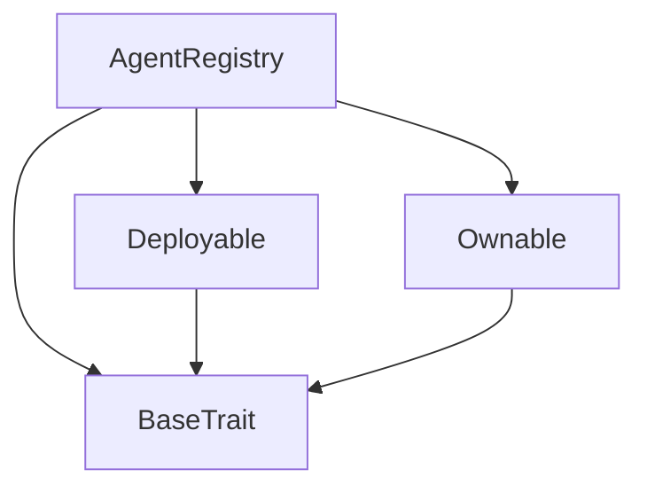
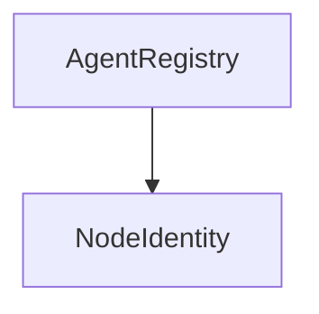

# Tact compilation report
Contract: AgentRegistry
BoC Size: 2131 bytes

## Structures (Structs and Messages)
Total structures: 26

### DataSize
TL-B: `_ cells:int257 bits:int257 refs:int257 = DataSize`
Signature: `DataSize{cells:int257,bits:int257,refs:int257}`

### SignedBundle
TL-B: `_ signature:fixed_bytes64 signedData:remainder<slice> = SignedBundle`
Signature: `SignedBundle{signature:fixed_bytes64,signedData:remainder<slice>}`

### StateInit
TL-B: `_ code:^cell data:^cell = StateInit`
Signature: `StateInit{code:^cell,data:^cell}`

### Context
TL-B: `_ bounceable:bool sender:address value:int257 raw:^slice = Context`
Signature: `Context{bounceable:bool,sender:address,value:int257,raw:^slice}`

### SendParameters
TL-B: `_ mode:int257 body:Maybe ^cell code:Maybe ^cell data:Maybe ^cell value:int257 to:address bounce:bool = SendParameters`
Signature: `SendParameters{mode:int257,body:Maybe ^cell,code:Maybe ^cell,data:Maybe ^cell,value:int257,to:address,bounce:bool}`

### MessageParameters
TL-B: `_ mode:int257 body:Maybe ^cell value:int257 to:address bounce:bool = MessageParameters`
Signature: `MessageParameters{mode:int257,body:Maybe ^cell,value:int257,to:address,bounce:bool}`

### DeployParameters
TL-B: `_ mode:int257 body:Maybe ^cell value:int257 bounce:bool init:StateInit{code:^cell,data:^cell} = DeployParameters`
Signature: `DeployParameters{mode:int257,body:Maybe ^cell,value:int257,bounce:bool,init:StateInit{code:^cell,data:^cell}}`

### StdAddress
TL-B: `_ workchain:int8 address:uint256 = StdAddress`
Signature: `StdAddress{workchain:int8,address:uint256}`

### VarAddress
TL-B: `_ workchain:int32 address:^slice = VarAddress`
Signature: `VarAddress{workchain:int32,address:^slice}`

### BasechainAddress
TL-B: `_ hash:Maybe int257 = BasechainAddress`
Signature: `BasechainAddress{hash:Maybe int257}`

### Deploy
TL-B: `deploy#946a98b6 queryId:uint64 = Deploy`
Signature: `Deploy{queryId:uint64}`

### DeployOk
TL-B: `deploy_ok#aff90f57 queryId:uint64 = DeployOk`
Signature: `DeployOk{queryId:uint64}`

### FactoryDeploy
TL-B: `factory_deploy#6d0ff13b queryId:uint64 cashback:address = FactoryDeploy`
Signature: `FactoryDeploy{queryId:uint64,cashback:address}`

### ChangeOwner
TL-B: `change_owner#819dbe99 queryId:uint64 newOwner:address = ChangeOwner`
Signature: `ChangeOwner{queryId:uint64,newOwner:address}`

### ChangeOwnerOk
TL-B: `change_owner_ok#327b2b4a queryId:uint64 newOwner:address = ChangeOwnerOk`
Signature: `ChangeOwnerOk{queryId:uint64,newOwner:address}`

### RegisterNode
TL-B: `register_node#6f6472bf nodeId:uint256 nodeType:uint8 publicKey:^slice genesisHash:uint256 capabilities:uint32 region:uint8 = RegisterNode`
Signature: `RegisterNode{nodeId:uint256,nodeType:uint8,publicKey:^slice,genesisHash:uint256,capabilities:uint32,region:uint8}`

### UpdateNodeStatus
TL-B: `update_node_status#317aa849 nodeId:uint256 status:uint8 reason:^string = UpdateNodeStatus`
Signature: `UpdateNodeStatus{nodeId:uint256,status:uint8,reason:^string}`

### UpdateReputation
TL-B: `update_reputation#a62085d1 nodeId:uint256 qualityDelta:int32 uptimeDelta:int32 tasksDelta:uint32 = UpdateReputation`
Signature: `UpdateReputation{nodeId:uint256,qualityDelta:int32,uptimeDelta:int32,tasksDelta:uint32}`

### ReportGenesisViolation
TL-B: `report_genesis_violation#44030afd nodeId:uint256 reporterNodeId:uint256 evidenceHash:uint256 = ReportGenesisViolation`
Signature: `ReportGenesisViolation{nodeId:uint256,reporterNodeId:uint256,evidenceHash:uint256}`

### SetGenesisManifest
TL-B: `set_genesis_manifest#8bdfc804 version:uint32 manifestHash:uint256 = SetGenesisManifest`
Signature: `SetGenesisManifest{version:uint32,manifestHash:uint256}`

### SlashNode
TL-B: `slash_node#aee7102c nodeId:uint256 amount:coins reason:^string = SlashNode`
Signature: `SlashNode{nodeId:uint256,amount:coins,reason:^string}`

### AgentRegistry$Data
TL-B: `_ owner:address settlementContract:address totalNodes:uint64 activeNodes:uint64 totalTasksCompleted:uint64 genesisVersion:uint32 genesisManifestHash:uint256 edgeCount:uint64 cpuCount:uint64 gpuCount:uint64 headCount:uint64 = AgentRegistry`
Signature: `AgentRegistry{owner:address,settlementContract:address,totalNodes:uint64,activeNodes:uint64,totalTasksCompleted:uint64,genesisVersion:uint32,genesisManifestHash:uint256,edgeCount:uint64,cpuCount:uint64,gpuCount:uint64,headCount:uint64}`

### NodeIdentity$Data
TL-B: `_ nodeId:uint256 registry:address owner:address nodeType:uint8 capabilities:uint32 region:uint8 qualityScore:int64 uptimeScore:int64 tasksCompleted:uint64 status:uint8 registeredAt:uint64 lastActiveAt:uint64 = NodeIdentity`
Signature: `NodeIdentity{nodeId:uint256,registry:address,owner:address,nodeType:uint8,capabilities:uint32,region:uint8,qualityScore:int64,uptimeScore:int64,tasksCompleted:uint64,status:uint8,registeredAt:uint64,lastActiveAt:uint64}`

### NetworkStats
TL-B: `_ totalNodes:uint64 activeNodes:uint64 totalTasksCompleted:uint64 edgeCount:uint64 cpuCount:uint64 gpuCount:uint64 headCount:uint64 = NetworkStats`
Signature: `NetworkStats{totalNodes:uint64,activeNodes:uint64,totalTasksCompleted:uint64,edgeCount:uint64,cpuCount:uint64,gpuCount:uint64,headCount:uint64}`

### GenesisManifestData
TL-B: `_ version:uint32 manifestHash:uint256 = GenesisManifestData`
Signature: `GenesisManifestData{version:uint32,manifestHash:uint256}`

### NodeInfo
TL-B: `_ nodeId:uint256 owner:address nodeType:uint8 capabilities:uint32 region:uint8 qualityScore:int64 uptimeScore:int64 tasksCompleted:uint64 status:uint8 registeredAt:uint64 lastActiveAt:uint64 = NodeInfo`
Signature: `NodeInfo{nodeId:uint256,owner:address,nodeType:uint8,capabilities:uint32,region:uint8,qualityScore:int64,uptimeScore:int64,tasksCompleted:uint64,status:uint8,registeredAt:uint64,lastActiveAt:uint64}`

## Get methods
Total get methods: 4

## get_network_stats
No arguments

## get_genesis_manifest
No arguments

## get_node_address
Argument: nodeId

## owner
No arguments

## Exit codes
* 2: Stack underflow
* 3: Stack overflow
* 4: Integer overflow
* 5: Integer out of expected range
* 6: Invalid opcode
* 7: Type check error
* 8: Cell overflow
* 9: Cell underflow
* 10: Dictionary error
* 11: 'Unknown' error
* 12: Fatal error
* 13: Out of gas error
* 14: Virtualization error
* 32: Action list is invalid
* 33: Action list is too long
* 34: Action is invalid or not supported
* 35: Invalid source address in outbound message
* 36: Invalid destination address in outbound message
* 37: Not enough Toncoin
* 38: Not enough extra currencies
* 39: Outbound message does not fit into a cell after rewriting
* 40: Cannot process a message
* 41: Library reference is null
* 42: Library change action error
* 43: Exceeded maximum number of cells in the library or the maximum depth of the Merkle tree
* 50: Account state size exceeded limits
* 128: Null reference exception
* 129: Invalid serialization prefix
* 130: Invalid incoming message
* 131: Constraints error
* 132: Access denied
* 133: Contract stopped
* 134: Invalid argument
* 135: Code of a contract was not found
* 136: Invalid standard address
* 138: Not a basechain address
* 27658: Only owner or Settlement
* 44404: Only DAO or Settlement can report violations
* 48099: Genesis manifest mismatch — update your node software
* 51748: Only registry
* 63399: Only DAO

## Trait inheritance diagram

## Contract dependency diagram

