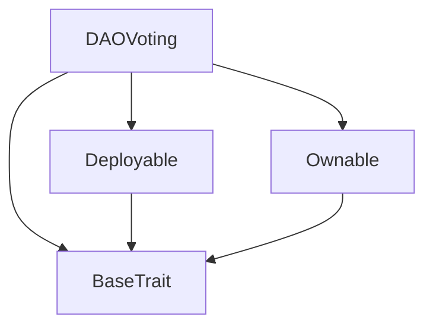
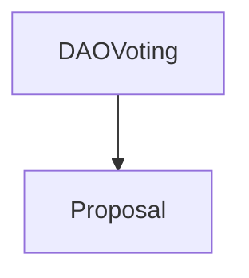

# Tact compilation report
Contract: DAOVoting
BoC Size: 2781 bytes

## Structures (Structs and Messages)
Total structures: 24

### DataSize
TL-B: `_ cells:int257 bits:int257 refs:int257 = DataSize`
Signature: `DataSize{cells:int257,bits:int257,refs:int257}`

### SignedBundle
TL-B: `_ signature:fixed_bytes64 signedData:remainder<slice> = SignedBundle`
Signature: `SignedBundle{signature:fixed_bytes64,signedData:remainder<slice>}`

### StateInit
TL-B: `_ code:^cell data:^cell = StateInit`
Signature: `StateInit{code:^cell,data:^cell}`

### Context
TL-B: `_ bounceable:bool sender:address value:int257 raw:^slice = Context`
Signature: `Context{bounceable:bool,sender:address,value:int257,raw:^slice}`

### SendParameters
TL-B: `_ mode:int257 body:Maybe ^cell code:Maybe ^cell data:Maybe ^cell value:int257 to:address bounce:bool = SendParameters`
Signature: `SendParameters{mode:int257,body:Maybe ^cell,code:Maybe ^cell,data:Maybe ^cell,value:int257,to:address,bounce:bool}`

### MessageParameters
TL-B: `_ mode:int257 body:Maybe ^cell value:int257 to:address bounce:bool = MessageParameters`
Signature: `MessageParameters{mode:int257,body:Maybe ^cell,value:int257,to:address,bounce:bool}`

### DeployParameters
TL-B: `_ mode:int257 body:Maybe ^cell value:int257 bounce:bool init:StateInit{code:^cell,data:^cell} = DeployParameters`
Signature: `DeployParameters{mode:int257,body:Maybe ^cell,value:int257,bounce:bool,init:StateInit{code:^cell,data:^cell}}`

### StdAddress
TL-B: `_ workchain:int8 address:uint256 = StdAddress`
Signature: `StdAddress{workchain:int8,address:uint256}`

### VarAddress
TL-B: `_ workchain:int32 address:^slice = VarAddress`
Signature: `VarAddress{workchain:int32,address:^slice}`

### BasechainAddress
TL-B: `_ hash:Maybe int257 = BasechainAddress`
Signature: `BasechainAddress{hash:Maybe int257}`

### Deploy
TL-B: `deploy#946a98b6 queryId:uint64 = Deploy`
Signature: `Deploy{queryId:uint64}`

### DeployOk
TL-B: `deploy_ok#aff90f57 queryId:uint64 = DeployOk`
Signature: `DeployOk{queryId:uint64}`

### FactoryDeploy
TL-B: `factory_deploy#6d0ff13b queryId:uint64 cashback:address = FactoryDeploy`
Signature: `FactoryDeploy{queryId:uint64,cashback:address}`

### ChangeOwner
TL-B: `change_owner#819dbe99 queryId:uint64 newOwner:address = ChangeOwner`
Signature: `ChangeOwner{queryId:uint64,newOwner:address}`

### ChangeOwnerOk
TL-B: `change_owner_ok#327b2b4a queryId:uint64 newOwner:address = ChangeOwnerOk`
Signature: `ChangeOwnerOk{queryId:uint64,newOwner:address}`

### CreateProposal
TL-B: `create_proposal#d47e9bc8 title:^string descriptionHash:uint256 targetContract:address payload:^cell votingPeriod:uint32 = CreateProposal`
Signature: `CreateProposal{title:^string,descriptionHash:uint256,targetContract:address,payload:^cell,votingPeriod:uint32}`

### CastVote
TL-B: `cast_vote#40c4959f proposalId:uint64 support:bool = CastVote`
Signature: `CastVote{proposalId:uint64,support:bool}`

### ExecuteProposal
TL-B: `execute_proposal#9340b747 proposalId:uint64 = ExecuteProposal`
Signature: `ExecuteProposal{proposalId:uint64}`

### CancelProposal
TL-B: `cancel_proposal#6a693742 proposalId:uint64 reason:^string = CancelProposal`
Signature: `CancelProposal{proposalId:uint64,reason:^string}`

### UpdateGovernanceParams
TL-B: `update_governance_params#7ed96f81 quorumPercent:uint8 timelockSeconds:uint32 minProposalStake:coins = UpdateGovernanceParams`
Signature: `UpdateGovernanceParams{quorumPercent:uint8,timelockSeconds:uint32,minProposalStake:coins}`

### DAOVoting$Data
TL-B: `_ owner:address gstdJetton:address quorumPercent:uint8 timelockSeconds:uint32 minProposalStake:coins totalStakedGSTD:coins proposalCount:uint64 executedCount:uint64 cancelledCount:uint64 = DAOVoting`
Signature: `DAOVoting{owner:address,gstdJetton:address,quorumPercent:uint8,timelockSeconds:uint32,minProposalStake:coins,totalStakedGSTD:coins,proposalCount:uint64,executedCount:uint64,cancelledCount:uint64}`

### Proposal$Data
TL-B: `_ proposalId:uint64 dao:address proposer:address targetContract:address payload:^cell votesFor:coins votesAgainst:coins voterCount:uint32 quorumStake:coins voters:dict<address, int> createdAt:uint64 votingEndsAt:uint64 executionUnlocksAt:uint64 status:uint8 = Proposal`
Signature: `Proposal{proposalId:uint64,dao:address,proposer:address,targetContract:address,payload:^cell,votesFor:coins,votesAgainst:coins,voterCount:uint32,quorumStake:coins,voters:dict<address, int>,createdAt:uint64,votingEndsAt:uint64,executionUnlocksAt:uint64,status:uint8}`

### GovernanceStats
TL-B: `_ proposalCount:uint64 executedCount:uint64 cancelledCount:uint64 quorumPercent:uint8 timelockSeconds:uint32 minProposalStake:coins totalStakedGSTD:coins = GovernanceStats`
Signature: `GovernanceStats{proposalCount:uint64,executedCount:uint64,cancelledCount:uint64,quorumPercent:uint8,timelockSeconds:uint32,minProposalStake:coins,totalStakedGSTD:coins}`

### ProposalData
TL-B: `_ proposalId:uint64 proposer:address targetContract:address votesFor:coins votesAgainst:coins voterCount:uint32 totalStaked:coins quorumStake:coins createdAt:uint64 votingEndsAt:uint64 executionUnlocksAt:uint64 status:uint8 = ProposalData`
Signature: `ProposalData{proposalId:uint64,proposer:address,targetContract:address,votesFor:coins,votesAgainst:coins,voterCount:uint32,totalStaked:coins,quorumStake:coins,createdAt:uint64,votingEndsAt:uint64,executionUnlocksAt:uint64,status:uint8}`

## Get methods
Total get methods: 3

## get_governance_stats
No arguments

## get_proposal_address
Argument: proposalId

## owner
No arguments

## Exit codes
* 2: Stack underflow
* 3: Stack overflow
* 4: Integer overflow
* 5: Integer out of expected range
* 6: Invalid opcode
* 7: Type check error
* 8: Cell overflow
* 9: Cell underflow
* 10: Dictionary error
* 11: 'Unknown' error
* 12: Fatal error
* 13: Out of gas error
* 14: Virtualization error
* 32: Action list is invalid
* 33: Action list is too long
* 34: Action is invalid or not supported
* 35: Invalid source address in outbound message
* 36: Invalid destination address in outbound message
* 37: Not enough Toncoin
* 38: Not enough extra currencies
* 39: Outbound message does not fit into a cell after rewriting
* 40: Cannot process a message
* 41: Library reference is null
* 42: Library change action error
* 43: Exceeded maximum number of cells in the library or the maximum depth of the Merkle tree
* 50: Account state size exceeded limits
* 128: Null reference exception
* 129: Invalid serialization prefix
* 130: Invalid incoming message
* 131: Constraints error
* 132: Access denied
* 133: Contract stopped
* 134: Invalid argument
* 135: Code of a contract was not found
* 136: Invalid standard address
* 138: Not a basechain address
* 8246: Voting not active
* 14831: Quorum must be 5-51%
* 15354: Cannot execute
* 15501: Voting period ended
* 30773: Cannot cancel
* 32600: No stake to claim
* 35499: Only owner
* 41880: Voting still active
* 42435: Not authorized
* 48241: Vote did not pass
* 48348: Only DAO can execute
* 51706: Quorum not reached
* 56882: Only owner/DAO multisig
* 57030: Must attach min 1 TON as proposal stake
* 59363: Must attach TON as voting stake
* 59369: Already voted
* 62971: Timelock not expired

## Trait inheritance diagram

## Contract dependency diagram

