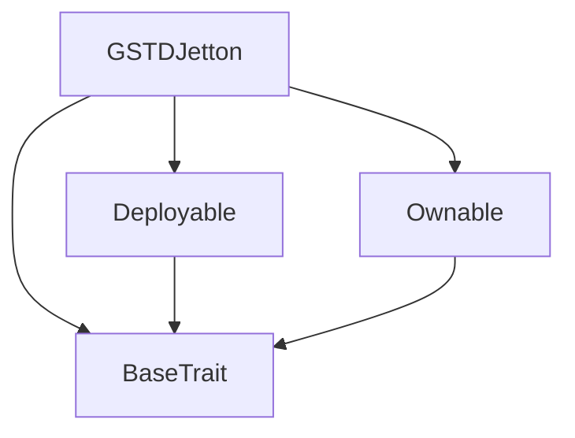
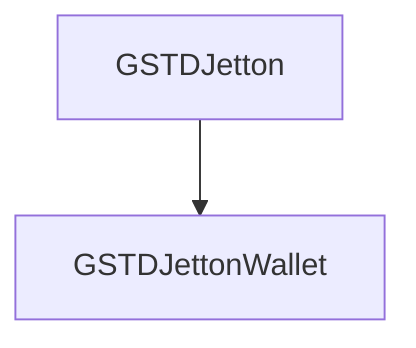

# Tact compilation report
Contract: GSTDJetton
BoC Size: 2699 bytes

## Structures (Structs and Messages)
Total structures: 30

### DataSize
TL-B: `_ cells:int257 bits:int257 refs:int257 = DataSize`
Signature: `DataSize{cells:int257,bits:int257,refs:int257}`

### SignedBundle
TL-B: `_ signature:fixed_bytes64 signedData:remainder<slice> = SignedBundle`
Signature: `SignedBundle{signature:fixed_bytes64,signedData:remainder<slice>}`

### StateInit
TL-B: `_ code:^cell data:^cell = StateInit`
Signature: `StateInit{code:^cell,data:^cell}`

### Context
TL-B: `_ bounceable:bool sender:address value:int257 raw:^slice = Context`
Signature: `Context{bounceable:bool,sender:address,value:int257,raw:^slice}`

### SendParameters
TL-B: `_ mode:int257 body:Maybe ^cell code:Maybe ^cell data:Maybe ^cell value:int257 to:address bounce:bool = SendParameters`
Signature: `SendParameters{mode:int257,body:Maybe ^cell,code:Maybe ^cell,data:Maybe ^cell,value:int257,to:address,bounce:bool}`

### MessageParameters
TL-B: `_ mode:int257 body:Maybe ^cell value:int257 to:address bounce:bool = MessageParameters`
Signature: `MessageParameters{mode:int257,body:Maybe ^cell,value:int257,to:address,bounce:bool}`

### DeployParameters
TL-B: `_ mode:int257 body:Maybe ^cell value:int257 bounce:bool init:StateInit{code:^cell,data:^cell} = DeployParameters`
Signature: `DeployParameters{mode:int257,body:Maybe ^cell,value:int257,bounce:bool,init:StateInit{code:^cell,data:^cell}}`

### StdAddress
TL-B: `_ workchain:int8 address:uint256 = StdAddress`
Signature: `StdAddress{workchain:int8,address:uint256}`

### VarAddress
TL-B: `_ workchain:int32 address:^slice = VarAddress`
Signature: `VarAddress{workchain:int32,address:^slice}`

### BasechainAddress
TL-B: `_ hash:Maybe int257 = BasechainAddress`
Signature: `BasechainAddress{hash:Maybe int257}`

### Deploy
TL-B: `deploy#946a98b6 queryId:uint64 = Deploy`
Signature: `Deploy{queryId:uint64}`

### DeployOk
TL-B: `deploy_ok#aff90f57 queryId:uint64 = DeployOk`
Signature: `DeployOk{queryId:uint64}`

### FactoryDeploy
TL-B: `factory_deploy#6d0ff13b queryId:uint64 cashback:address = FactoryDeploy`
Signature: `FactoryDeploy{queryId:uint64,cashback:address}`

### ChangeOwner
TL-B: `change_owner#819dbe99 queryId:uint64 newOwner:address = ChangeOwner`
Signature: `ChangeOwner{queryId:uint64,newOwner:address}`

### ChangeOwnerOk
TL-B: `change_owner_ok#327b2b4a queryId:uint64 newOwner:address = ChangeOwnerOk`
Signature: `ChangeOwnerOk{queryId:uint64,newOwner:address}`

### MintWorkerReward
TL-B: `mint_worker_reward#bb7a9ab8 workerAddr:address amount:coins taskId:uint64 = MintWorkerReward`
Signature: `MintWorkerReward{workerAddr:address,amount:coins,taskId:uint64}`

### SetMintAuthority
TL-B: `set_mint_authority#6cbd4f45 newAuthority:address = SetMintAuthority`
Signature: `SetMintAuthority{newAuthority:address}`

### BurnNotification
TL-B: `burn_notification#6377b77f queryId:uint64 amount:coins sender:address responseDestination:address = BurnNotification`
Signature: `BurnNotification{queryId:uint64,amount:coins,sender:address,responseDestination:address}`

### TransferNotification
TL-B: `transfer_notification#f4e4f591 queryId:uint64 amount:coins sender:address forwardPayload:remainder<slice> = TransferNotification`
Signature: `TransferNotification{queryId:uint64,amount:coins,sender:address,forwardPayload:remainder<slice>}`

### TokenUpdateContent
TL-B: `token_update_content#af1ca26a content:^cell = TokenUpdateContent`
Signature: `TokenUpdateContent{content:^cell}`

### Transfer
TL-B: `transfer#558e297b queryId:uint64 amount:coins destination:address responseDestination:address customPayload:Maybe ^cell forwardTonAmount:coins forwardPayload:remainder<slice> = Transfer`
Signature: `Transfer{queryId:uint64,amount:coins,destination:address,responseDestination:address,customPayload:Maybe ^cell,forwardTonAmount:coins,forwardPayload:remainder<slice>}`

### InternalTransfer
TL-B: `internal_transfer#ac130557 queryId:uint64 amount:coins from:address responseAddress:address forwardTonAmount:coins forwardPayload:remainder<slice> = InternalTransfer`
Signature: `InternalTransfer{queryId:uint64,amount:coins,from:address,responseAddress:address,forwardTonAmount:coins,forwardPayload:remainder<slice>}`

### Burn
TL-B: `burn#4056115d queryId:uint64 amount:coins responseDestination:address = Burn`
Signature: `Burn{queryId:uint64,amount:coins,responseDestination:address}`

### GSTDJetton$Data
TL-B: `_ totalSupply:coins maxSupply:coins owner:address mintAuthority:address content:^cell mintable:bool workerPoolMinted:coins workerPoolMax:coins totalBurned:coins totalMintEvents:uint64 authorityLocked:bool = GSTDJetton`
Signature: `GSTDJetton{totalSupply:coins,maxSupply:coins,owner:address,mintAuthority:address,content:^cell,mintable:bool,workerPoolMinted:coins,workerPoolMax:coins,totalBurned:coins,totalMintEvents:uint64,authorityLocked:bool}`

### FreezeMint
TL-B: `freeze_mint#3ceedd0a  = FreezeMint`
Signature: `FreezeMint{}`

### JettonData
TL-B: `_ totalSupply:coins mintable:bool adminAddress:address jettonContent:^cell jettonWalletCode:^cell = JettonData`
Signature: `JettonData{totalSupply:coins,mintable:bool,adminAddress:address,jettonContent:^cell,jettonWalletCode:^cell}`

### WorkerPoolStats
TL-B: `_ minted:coins max:coins remaining:coins = WorkerPoolStats`
Signature: `WorkerPoolStats{minted:coins,max:coins,remaining:coins}`

### BurnStats
TL-B: `_ totalBurned:coins circulatingSupply:coins totalMintEvents:uint64 = BurnStats`
Signature: `BurnStats{totalBurned:coins,circulatingSupply:coins,totalMintEvents:uint64}`

### GSTDJettonWallet$Data
TL-B: `_ balance:coins owner:address jettonMaster:address = GSTDJettonWallet`
Signature: `GSTDJettonWallet{balance:coins,owner:address,jettonMaster:address}`

### WalletData
TL-B: `_ balance:coins owner:address jettonMaster:address jettonWalletCode:^cell = WalletData`
Signature: `WalletData{balance:coins,owner:address,jettonMaster:address,jettonWalletCode:^cell}`

## Get methods
Total get methods: 7

## get_jetton_data
No arguments

## get_wallet_address
Argument: ownerAddress

## get_max_supply
No arguments

## get_worker_pool_stats
No arguments

## get_burn_stats
No arguments

## get_mint_authority
No arguments

## owner
No arguments

## Exit codes
* 2: Stack underflow
* 3: Stack overflow
* 4: Integer overflow
* 5: Integer out of expected range
* 6: Invalid opcode
* 7: Type check error
* 8: Cell overflow
* 9: Cell underflow
* 10: Dictionary error
* 11: 'Unknown' error
* 12: Fatal error
* 13: Out of gas error
* 14: Virtualization error
* 32: Action list is invalid
* 33: Action list is too long
* 34: Action is invalid or not supported
* 35: Invalid source address in outbound message
* 36: Invalid destination address in outbound message
* 37: Not enough Toncoin
* 38: Not enough extra currencies
* 39: Outbound message does not fit into a cell after rewriting
* 40: Cannot process a message
* 41: Library reference is null
* 42: Library change action error
* 43: Exceeded maximum number of cells in the library or the maximum depth of the Merkle tree
* 50: Account state size exceeded limits
* 128: Null reference exception
* 129: Invalid serialization prefix
* 130: Invalid incoming message
* 131: Constraints error
* 132: Access denied
* 133: Contract stopped
* 134: Invalid argument
* 135: Code of a contract was not found
* 136: Invalid standard address
* 138: Not a basechain address
* 3820: Invalid burn notification
* 4429: Invalid sender
* 8319: Only Settlement can mint
* 21543: Only owner can burn
* 28612: Mint authority already locked
* 35499: Only owner
* 36952: Only owner can transfer
* 37727: Worker pool exhausted
* 47714: Max supply reached
* 54615: Insufficient balance
* 56760: Minting disabled

## Trait inheritance diagram

## Contract dependency diagram

