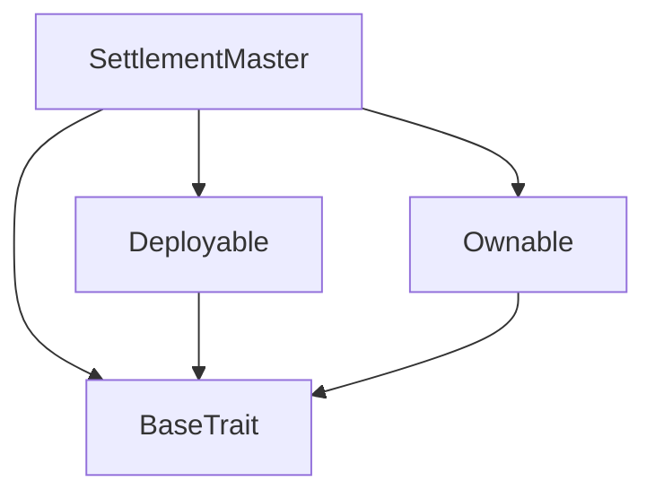
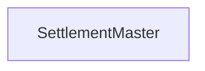

# Tact compilation report
Contract: SettlementMaster
BoC Size: 2326 bytes

## Structures (Structs and Messages)
Total structures: 27

### DataSize
TL-B: `_ cells:int257 bits:int257 refs:int257 = DataSize`
Signature: `DataSize{cells:int257,bits:int257,refs:int257}`

### SignedBundle
TL-B: `_ signature:fixed_bytes64 signedData:remainder<slice> = SignedBundle`
Signature: `SignedBundle{signature:fixed_bytes64,signedData:remainder<slice>}`

### StateInit
TL-B: `_ code:^cell data:^cell = StateInit`
Signature: `StateInit{code:^cell,data:^cell}`

### Context
TL-B: `_ bounceable:bool sender:address value:int257 raw:^slice = Context`
Signature: `Context{bounceable:bool,sender:address,value:int257,raw:^slice}`

### SendParameters
TL-B: `_ mode:int257 body:Maybe ^cell code:Maybe ^cell data:Maybe ^cell value:int257 to:address bounce:bool = SendParameters`
Signature: `SendParameters{mode:int257,body:Maybe ^cell,code:Maybe ^cell,data:Maybe ^cell,value:int257,to:address,bounce:bool}`

### MessageParameters
TL-B: `_ mode:int257 body:Maybe ^cell value:int257 to:address bounce:bool = MessageParameters`
Signature: `MessageParameters{mode:int257,body:Maybe ^cell,value:int257,to:address,bounce:bool}`

### DeployParameters
TL-B: `_ mode:int257 body:Maybe ^cell value:int257 bounce:bool init:StateInit{code:^cell,data:^cell} = DeployParameters`
Signature: `DeployParameters{mode:int257,body:Maybe ^cell,value:int257,bounce:bool,init:StateInit{code:^cell,data:^cell}}`

### StdAddress
TL-B: `_ workchain:int8 address:uint256 = StdAddress`
Signature: `StdAddress{workchain:int8,address:uint256}`

### VarAddress
TL-B: `_ workchain:int32 address:^slice = VarAddress`
Signature: `VarAddress{workchain:int32,address:^slice}`

### BasechainAddress
TL-B: `_ hash:Maybe int257 = BasechainAddress`
Signature: `BasechainAddress{hash:Maybe int257}`

### Deploy
TL-B: `deploy#946a98b6 queryId:uint64 = Deploy`
Signature: `Deploy{queryId:uint64}`

### DeployOk
TL-B: `deploy_ok#aff90f57 queryId:uint64 = DeployOk`
Signature: `DeployOk{queryId:uint64}`

### FactoryDeploy
TL-B: `factory_deploy#6d0ff13b queryId:uint64 cashback:address = FactoryDeploy`
Signature: `FactoryDeploy{queryId:uint64,cashback:address}`

### ChangeOwner
TL-B: `change_owner#819dbe99 queryId:uint64 newOwner:address = ChangeOwner`
Signature: `ChangeOwner{queryId:uint64,newOwner:address}`

### ChangeOwnerOk
TL-B: `change_owner_ok#327b2b4a queryId:uint64 newOwner:address = ChangeOwnerOk`
Signature: `ChangeOwnerOk{queryId:uint64,newOwner:address}`

### SettleTask
TL-B: `settle_task#572e9ef8 taskId:uint64 workerAddr:address gstdBonusAmount:coins qualityScore:uint32 computeUnits:uint64 = SettleTask`
Signature: `SettleTask{taskId:uint64,workerAddr:address,gstdBonusAmount:coins,qualityScore:uint32,computeUnits:uint64}`

### WorkerPayment
TL-B: `worker_payment#59694c6e taskId:uint64 amount:coins bonusGSTD:coins = WorkerPayment`
Signature: `WorkerPayment{taskId:uint64,amount:coins,bonusGSTD:coins}`

### UpdateShares
TL-B: `update_shares#beda40ac worker:uint8 treasury:uint8 protocol:uint8 = UpdateShares`
Signature: `UpdateShares{worker:uint8,treasury:uint8,protocol:uint8}`

### UpdateAddresses
TL-B: `update_addresses#540bd399 treasury:address protocolFee:address gstdJetton:address = UpdateAddresses`
Signature: `UpdateAddresses{treasury:address,protocolFee:address,gstdJetton:address}`

### MintWorkerReward
TL-B: `mint_worker_reward#bb7a9ab8 workerAddr:address amount:coins taskId:uint64 = MintWorkerReward`
Signature: `MintWorkerReward{workerAddr:address,amount:coins,taskId:uint64}`

### SetBaseRate
TL-B: `set_base_rate#d70e7cef rate:coins = SetBaseRate`
Signature: `SetBaseRate{rate:coins}`

### EmergencyPause
TL-B: `emergency_pause#3f7082c1 paused:bool = EmergencyPause`
Signature: `EmergencyPause{paused:bool}`

### SetGateway
TL-B: `set_gateway#a85e4bb4 gateway:address = SetGateway`
Signature: `SetGateway{gateway:address}`

### SettlementMaster$Data
TL-B: `_ owner:address gateway:address gstdJetton:address treasury:address protocolFee:address workerShare:uint8 treasuryShare:uint8 protocolShare:uint8 baseRate:coins totalSettled:coins totalGSTDMinted:coins taskCount:uint64 settledTasks:dict<int, bool> paused:bool minPayment:coins = SettlementMaster`
Signature: `SettlementMaster{owner:address,gateway:address,gstdJetton:address,treasury:address,protocolFee:address,workerShare:uint8,treasuryShare:uint8,protocolShare:uint8,baseRate:coins,totalSettled:coins,totalGSTDMinted:coins,taskCount:uint64,settledTasks:dict<int, bool>,paused:bool,minPayment:coins}`

### SettlementStats
TL-B: `_ totalSettled:coins totalGSTDMinted:coins taskCount:uint64 baseRate:coins = SettlementStats`
Signature: `SettlementStats{totalSettled:coins,totalGSTDMinted:coins,taskCount:uint64,baseRate:coins}`

### RevenueSplit
TL-B: `_ worker:uint8 treasury:uint8 protocol:uint8 = RevenueSplit`
Signature: `RevenueSplit{worker:uint8,treasury:uint8,protocol:uint8}`

### ContractAddresses
TL-B: `_ gstdJetton:address treasury:address protocolFee:address owner:address = ContractAddresses`
Signature: `ContractAddresses{gstdJetton:address,treasury:address,protocolFee:address,owner:address}`

## Get methods
Total get methods: 5

## get_settlement_stats
No arguments

## get_revenue_split
No arguments

## get_addresses
No arguments

## is_paused
No arguments

## owner
No arguments

## Exit codes
* 2: Stack underflow
* 3: Stack overflow
* 4: Integer overflow
* 5: Integer out of expected range
* 6: Invalid opcode
* 7: Type check error
* 8: Cell overflow
* 9: Cell underflow
* 10: Dictionary error
* 11: 'Unknown' error
* 12: Fatal error
* 13: Out of gas error
* 14: Virtualization error
* 32: Action list is invalid
* 33: Action list is too long
* 34: Action is invalid or not supported
* 35: Invalid source address in outbound message
* 36: Invalid destination address in outbound message
* 37: Not enough Toncoin
* 38: Not enough extra currencies
* 39: Outbound message does not fit into a cell after rewriting
* 40: Cannot process a message
* 41: Library reference is null
* 42: Library change action error
* 43: Exceeded maximum number of cells in the library or the maximum depth of the Merkle tree
* 50: Account state size exceeded limits
* 128: Null reference exception
* 129: Invalid serialization prefix
* 130: Invalid incoming message
* 131: Constraints error
* 132: Access denied
* 133: Contract stopped
* 134: Invalid argument
* 135: Code of a contract was not found
* 136: Invalid standard address
* 138: Not a basechain address
* 8484: Payment below minimum
* 22722: Must sum to 100
* 27818: Rate must be positive
* 32292: Worker address cannot be zero
* 38610: Settlement paused
* 45933: Worker share minimum 50%
* 50353: Only DAO or Gateway can settle
* 54291: Task already settled
* 63399: Only DAO

## Trait inheritance diagram

## Contract dependency diagram

